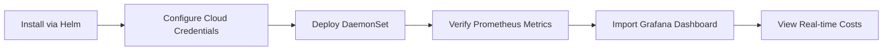

# Kube-Cost-Exporter

## 1. Pain Point Analysis

### Current Market Problem

**The Kubecost Dilemma:**
- Kubecost's free version lacks real-time metrics and only provides basic cost allocation
- Enterprise version costs $349+ per cluster per month
- Developers need Prometheus integration but Kubecost requires separate data store
- No native Grafana dashboard support in free tier
- Limited to 15-day data retention without paid upgrade

**Real-World Impact:**
- Engineering teams spend 8-12 hours/month manually calculating pod costs
- Finance teams can't get real-time cost dashboards without expensive tools
- Platform teams struggle to justify Kubernetes spending to executives
- Spot instance cost calculations are manual and error-prone
- No way to track cost trends over time without enterprise tools

**Developer Frustrations (from G2 Reviews):**
- "Kubecost free version is too limited for production use"
- "Need real-time cost metrics in our existing Grafana stack"
- "Can't export cost data to our FinOps toolchain"
- "Spot pricing calculations are always outdated"

### Target Users

1. **DevOps Engineers** - Need real-time cost visibility in existing monitoring stack
2. **Platform Teams** - Building internal developer portals with cost metrics
3. **FinOps Practitioners** - Require cost data in centralized dashboards
4. **Engineering Managers** - Need to track team/project costs over time

### Success Metrics

- **Time Saved**: Reduce manual cost calculation from 10 hours/month → 0 hours
- **Cost Visibility**: Real-time cost metrics updated every 60 seconds
- **Adoption**: Integration with existing Prometheus/Grafana in <15 minutes
- **Accuracy**: 95%+ accuracy compared to actual cloud bills

---

## 2. User Workflow & UI/UX

### Installation Workflow



### CLI User Experience

**Step 1: Quick Installation**
```bash
# One-line install via Helm
helm repo add deepcost https://deepcost.github.io/kube-cost-exporter
helm install kube-cost-exporter deepcost/kube-cost-exporter \
  --set cloudProvider=aws \
  --set prometheusEndpoint=http://prometheus:9090
```

**Step 2: Verify Metrics Export**
```bash
# Check metrics are being exported
curl http://kube-cost-exporter:9090/metrics | grep kube_cost

# Expected output:
# kube_cost_pod_hourly_usd{namespace="production",pod="api-server-xyz"} 0.045
# kube_cost_pod_hourly_usd{namespace="staging",pod="worker-abc"} 0.012
```

**Step 3: Query Costs via CLI**
```bash
# Get namespace costs for last 24 hours
kubectl cost namespace production --window 24h

# Output:
# NAMESPACE    TOTAL COST    POD COUNT    AVG POD COST
# production   $45.20        15           $3.01
# staging      $12.30        8            $1.54
```

### Grafana Dashboard UI

**Dashboard Layout:**

```
┌─────────────────────────────────────────────────────────────┐
│  Kubernetes Cost Overview - Last 7 Days                     │
├─────────────────────────────────────────────────────────────┤
│  Total Spend: $1,245.00    ▲ 12% vs last week              │
│  Compute: $890   Storage: $200   Network: $155             │
├─────────────────────────────────────────────────────────────┤
│  [Line Chart: Daily Cost Trend]                             │
│  Shows compute, storage, network costs stacked              │
├─────────────────────────────────────────────────────────────┤
│  Top 5 Namespaces by Cost:                                  │
│  1. production    $456.00  [============================]   │
│  2. staging       $234.00  [==============]                 │
│  3. ml-training   $189.00  [===========]                    │
│  4. dev           $98.00   [======]                         │
│  5. monitoring    $67.00   [====]                           │
├─────────────────────────────────────────────────────────────┤
│  Spot vs On-Demand Savings:                                 │
│  Spot: $345 (38%)   On-Demand: $565 (62%)                  │
│  Potential Savings: $234/month if 70% spot                  │
└─────────────────────────────────────────────────────────────┘
```

**Interactive Features:**
- Click namespace → drill down to pod-level costs
- Hover over chart → see exact cost at that timestamp
- Filter by: namespace, deployment, node pool, instance type
- Export to CSV for finance reporting

### Alert Configuration UI

**Prometheus Alert Manager Integration:**

```yaml
# Alert when namespace cost exceeds budget
- alert: NamespaceCostBudgetExceeded
  expr: sum(kube_cost_pod_hourly_usd{namespace="production"}) * 730 > 500
  annotations:
    summary: "Production namespace exceeds $500/month budget"
    dashboard: "https://grafana/d/costs/namespace?var-ns=production"
```

**Slack Alert Example:**
```
⚠️ Cost Alert: Production Namespace

Current Monthly Run Rate: $567.00
Budget: $500.00
Over Budget: $67.00 (13.4%)

Top Cost Drivers:
1. api-server-v2 - $123/mo (21%)
2. ml-inference - $98/mo (17%)

🔗 View Dashboard | 🛠️ Optimize Now
```

---

## 3. Client Tools Integration

### Kubernetes Integration

**Deployment Method:**
- Runs as DaemonSet on every node
- Lightweight sidecar (50MB RAM, 0.1 CPU)
- Reads node pricing from cloud provider APIs
- Calculates costs using resource requests/usage

**Required Permissions:**
```yaml
apiVersion: v1
kind: ServiceAccount
metadata:
  name: kube-cost-exporter
---
apiVersion: rbac.authorization.k8s.io/v1
kind: ClusterRole
metadata:
  name: kube-cost-exporter
rules:
- apiGroups: [""]
  resources: ["nodes", "pods", "persistentvolumes"]
  verbs: ["get", "list", "watch"]
- apiGroups: ["metrics.k8s.io"]
  resources: ["nodes", "pods"]
  verbs: ["get", "list"]
```

### Prometheus Integration

**Metrics Exported:**

| Metric Name | Type | Labels | Description |
|------------|------|--------|-------------|
| `kube_cost_pod_hourly_usd` | Gauge | namespace, pod, node | Hourly cost per pod |
| `kube_cost_namespace_daily_usd` | Gauge | namespace | Daily cost per namespace |
| `kube_cost_node_hourly_usd` | Gauge | node, instance_type | Hourly cost per node |
| `kube_cost_pv_monthly_usd` | Gauge | pv_name, storage_class | Monthly storage cost |
| `kube_cost_spot_savings_usd` | Counter | namespace | Total savings from spot instances |

**Prometheus Query Examples:**
```promql
# Total monthly K8s cost
sum(kube_cost_pod_hourly_usd) * 730

# Cost by namespace (last 7 days)
sum by (namespace) (
  rate(kube_cost_pod_hourly_usd[7d]) * 24 * 7
)

# Spot instance savings %
(sum(kube_cost_spot_savings_usd) / sum(kube_cost_pod_hourly_usd)) * 100
```

### Grafana Integration

**Pre-built Dashboards:**
1. **Executive Summary** - High-level cost overview with trends
2. **Namespace Deep Dive** - Per-namespace cost breakdown
3. **Resource Efficiency** - Over/under-provisioned resources
4. **Spot Instance Optimizer** - Spot vs on-demand analysis
5. **Forecast Dashboard** - Cost projections based on trends

**Dashboard Variables:**
- `$namespace` - Filter by namespace
- `$cluster` - Multi-cluster support
- `$timerange` - 24h, 7d, 30d, 90d
- `$instance_type` - Filter by EC2/GCE instance family

### Cloud Provider Integration

**AWS Integration:**
```yaml
cloudProvider:
  aws:
    # Option 1: Use IRSA (recommended)
    serviceAccount:
      annotations:
        eks.amazonaws.com/role-arn: arn:aws:iam::123456789:role/kube-cost-exporter
    
    # Option 2: Use pricing API
    region: us-east-1
    pricingAPIEnabled: true
    spotPriceRefreshInterval: 5m
```

**GCP Integration:**
```yaml
cloudProvider:
  gcp:
    # Use Workload Identity
    serviceAccount: kube-cost-exporter@project.iam.gserviceaccount.com
    project: my-gcp-project
    # Pulls GCE pricing automatically
```

**Azure Integration:**
```yaml
cloudProvider:
  azure:
    # Managed Identity
    subscriptionId: "xxxxx-xxxx-xxxx"
    # Uses Azure Retail Prices API
```

### CI/CD Integration

**GitHub Actions Example:**
```yaml
name: Check Cost Impact

on: [pull_request]

jobs:
  cost-check:
    runs-on: ubuntu-latest
    steps:
      - name: Analyze Deployment Cost
        run: |
          # Calculate cost of new deployment
          kubectl cost estimate -f deployment.yaml
          
          # Fail if cost increase > 10%
          if [ $COST_INCREASE -gt 10 ]; then
            echo "::error::Deployment increases costs by ${COST_INCREASE}%"
            exit 1
          fi
```

### Terraform Integration

**Export Cost Tags:**
```hcl
resource "kubernetes_namespace" "production" {
  metadata {
    name = "production"
    labels = {
      "cost-center" = "engineering"
      "budget"      = "5000"
    }
  }
}

# Auto-generate cost reports
data "prometheus_query" "namespace_cost" {
  query = "sum(kube_cost_namespace_daily_usd{namespace='production'}) * 30"
}
```

---

## 4. Architecture Design

### High-Level Architecture

```
┌─────────────────────────────────────────────────────────────┐
│                      Kubernetes Cluster                      │
├─────────────────────────────────────────────────────────────┤
│                                                               │
│  ┌──────────────┐  ┌──────────────┐  ┌──────────────┐       │
│  │   Node 1     │  │   Node 2     │  │   Node 3     │       │
│  │              │  │              │  │              │       │
│  │ ┌──────────┐ │  │ ┌──────────┐ │  │ ┌──────────┐ │       │
│  │ │Cost Agent│ │  │ │Cost Agent│ │  │ │Cost Agent│ │       │
│  │ └────┬─────┘ │  │ └────┬─────┘ │  │ └────┬─────┘ │       │
│  └──────┼───────┘  └──────┼───────┘  └──────┼───────┘       │
│         │                  │                  │               │
│         └──────────────────┼──────────────────┘               │
│                            │                                  │
│                    ┌───────▼────────┐                         │
│                    │ Aggregator Svc │                         │
│                    │  (Deployment)  │                         │
│                    └───────┬────────┘                         │
│                            │                                  │
└────────────────────────────┼──────────────────────────────────┘
                             │
                    ┌────────▼────────┐
                    │ Prometheus      │◄────── Scrape /metrics
                    │   (9090)        │
                    └────────┬────────┘
                             │
                    ┌────────▼────────┐
                    │   Grafana       │◄────── Visualize
                    │   (3000)        │
                    └─────────────────┘

External APIs:
┌──────────────────┐
│ AWS Pricing API  │────► Spot prices, instance costs
│ GCP Billing API  │────► Sustained use discounts
│ Azure Retail API │────► VM pricing, storage costs
└──────────────────┘
```

### Component Architecture

#### 1. Cost Agent (DaemonSet)

**Responsibilities:**
- Runs on every Kubernetes node
- Collects pod resource usage from cgroups
- Reads node instance type and pricing
- Calculates per-pod costs in real-time
- Exports metrics to Aggregator

**Data Collection Flow:**
```
Node Metadata → Instance Type → Cloud Pricing API → Hourly Rate
     +
Pod Resources → CPU/Memory Usage → Resource Requests → Pod Cost
     ↓
Metrics: kube_cost_pod_hourly_usd{namespace, pod, node}
```

**Key Metrics Collected:**
- CPU usage (millicores)
- Memory usage (bytes)
- Network I/O (bytes transferred)
- Storage I/O (IOPS, throughput)
- GPU usage (if applicable)

#### 2. Aggregator Service (Deployment)

**Responsibilities:**
- Receives metrics from all Cost Agents
- Aggregates namespace/cluster-level costs
- Calculates spot instance savings
- Provides HTTP endpoint for Prometheus scraping
- Caches pricing data to reduce API calls

**Aggregation Logic:**
```
Namespace Cost = Σ (Pod Costs in Namespace)
Cluster Cost = Σ (All Node Costs + Storage Costs + Data Transfer)
Savings = (On-Demand Price - Spot Price) × Spot Instance Hours
```

**Caching Strategy:**
- Instance pricing: 1 hour TTL
- Spot prices: 5 minutes TTL
- Storage pricing: 24 hours TTL
- Network egress: 1 hour TTL

#### 3. Pricing Engine

**Cloud Provider Adapters:**

```
┌────────────────────────────────────────────┐
│          Pricing Engine Interface          │
├────────────────────────────────────────────┤
│                                            │
│  getInstancePrice(type, region, az)       │
│  getSpotPrice(type, region, az)           │
│  getStoragePrice(type, size, region)      │
│  getNetworkPrice(region, destination)     │
│                                            │
└──────┬─────────────┬─────────────┬─────────┘
       │             │             │
   ┌───▼───┐    ┌────▼────┐   ┌───▼────┐
   │  AWS  │    │   GCP   │   │ Azure  │
   │Adapter│    │ Adapter │   │Adapter │
   └───────┘    └─────────┘   └────────┘
```

**Pricing Data Sources:**
- **AWS**: EC2 Pricing API, Spot Price History API
- **GCP**: Cloud Billing API, Committed Use Discounts
- **Azure**: Retail Prices API, Reserved Instances

**Rate Limiting:**
- Max 100 API calls/minute to cloud providers
- Exponential backoff on errors
- Circuit breaker pattern for API failures

### Data Flow Architecture

```
┌─────────────────────────────────────────────────────────────┐
│ Step 1: Metrics Collection (Every 60 seconds)               │
└─────────────────────────────────────────────────────────────┘
         │
         ▼
┌─────────────────────────────────────────────────────────────┐
│ Cost Agent reads:                                            │
│ • kubectl get nodes -o json (instance type, zone)           │
│ • /sys/fs/cgroup/cpu (CPU usage)                            │
│ • /sys/fs/cgroup/memory (Memory usage)                      │
│ • Kubernetes Metrics Server (resource requests)             │
└─────────────────────────────────────────────────────────────┘
         │
         ▼
┌─────────────────────────────────────────────────────────────┐
│ Step 2: Cost Calculation                                     │
└─────────────────────────────────────────────────────────────┘
         │
         ▼
┌─────────────────────────────────────────────────────────────┐
│ Pricing Engine:                                              │
│ • Query AWS Pricing API for c5.2xlarge in us-east-1        │
│ • Cache result: $0.34/hour                                  │
│ • Calculate pod cost based on resource allocation:          │
│   Pod Cost = (Pod CPU / Node CPU) × Node Hourly Cost       │
└─────────────────────────────────────────────────────────────┘
         │
         ▼
┌─────────────────────────────────────────────────────────────┐
│ Step 3: Metric Export                                        │
└─────────────────────────────────────────────────────────────┘
         │
         ▼
┌─────────────────────────────────────────────────────────────┐
│ Aggregator exposes:                                          │
│ GET /metrics                                                 │
│                                                              │
│ # HELP kube_cost_pod_hourly_usd Hourly cost of pod in USD  │
│ # TYPE kube_cost_pod_hourly_usd gauge                       │
│ kube_cost_pod_hourly_usd{namespace="prod",pod="api"} 0.045  │
└─────────────────────────────────────────────────────────────┘
         │
         ▼
┌─────────────────────────────────────────────────────────────┐
│ Step 4: Prometheus Scrape                                    │
└─────────────────────────────────────────────────────────────┘
         │
         ▼
┌─────────────────────────────────────────────────────────────┐
│ Grafana visualizes:                                          │
│ • Daily cost trends                                          │
│ • Namespace breakdown                                        │
│ • Budget vs actual                                           │
└─────────────────────────────────────────────────────────────┘
```

### Database Design (Optional Time-Series Storage)

**For Long-term Storage (>15 days):**

```sql
-- TimescaleDB Schema for historical cost data

CREATE TABLE pod_costs (
    timestamp TIMESTAMPTZ NOT NULL,
    cluster_id VARCHAR(50),
    namespace VARCHAR(63),
    pod_name VARCHAR(253),
    node_name VARCHAR(63),
    instance_type VARCHAR(50),
    cpu_millicores INT,
    memory_bytes BIGINT,
    hourly_cost_usd DECIMAL(10, 6),
    PRIMARY KEY (timestamp, cluster_id, namespace, pod_name)
);

-- Hypertable for time-series optimization
SELECT create_hypertable('pod_costs', 'timestamp');

-- Retention policy: 90 days
SELECT add_retention_policy('pod_costs', INTERVAL '90 days');

-- Continuous aggregate for daily rollups
CREATE MATERIALIZED VIEW daily_namespace_costs
WITH (timescaledb.continuous) AS
SELECT
    time_bucket('1 day', timestamp) AS day,
    cluster_id,
    namespace,
    SUM(hourly_cost_usd) * 24 AS daily_cost_usd
FROM pod_costs
GROUP BY day, cluster_id, namespace;
```

### Security Architecture

**Authentication & Authorization:**
```
┌─────────────────────────────────────────────┐
│ RBAC Security Model                         │
├─────────────────────────────────────────────┤
│                                             │
│ Cost Agent Service Account:                │
│  - Read-only access to nodes, pods, PVs    │
│  - No write permissions                     │
│  - No secret access                         │
│                                             │
│ Cloud Provider Credentials:                │
│  - AWS: IRSA with least-privilege IAM role │
│  - GCP: Workload Identity                  │
│  - Azure: Managed Identity                 │
│                                             │
│ Metrics Endpoint:                          │
│  - Basic auth or bearer token              │
│  - IP whitelist for Prometheus             │
│  - TLS encryption                           │
└─────────────────────────────────────────────┘
```

**Data Privacy:**
- No sensitive pod data collected (only metadata)
- Cost metrics don't include environment variables or secrets
- Optional PII scrubbing (remove pod names, use hashes)

### Scalability Considerations

**Horizontal Scaling:**
- DaemonSet scales automatically with cluster size
- Aggregator can be replicated (stateless)
- Prometheus federation for multi-cluster

**Performance Benchmarks:**
- 1,000 pods: <100MB RAM, <0.5 CPU
- 10,000 pods: <500MB RAM, <2 CPU
- Metric export: <50ms p99 latency

**Optimization Techniques:**
- Batch metric updates (every 60s instead of real-time)
- Cache pricing data aggressively
- Use protobuf for inter-service communication
- Compress metrics with zstd

---

## 5. Implementation Considerations

### Technology Stack

**Core Components:**
- **Language**: Go (for performance, small binaries)
- **Metrics**: Prometheus client library
- **K8s Client**: client-go for Kubernetes API
- **Cloud SDKs**: AWS SDK v2, GCP SDK, Azure SDK
- **Storage**: Optional TimescaleDB for historical data

**Deployment:**
- **Packaging**: Helm chart
- **Container**: Alpine-based Docker image (<50MB)
- **Config**: ConfigMaps for settings, Secrets for cloud credentials

### Configuration Options

```yaml
# values.yaml (Helm chart)

cloudProvider: aws  # aws | gcp | azure

aws:
  region: us-east-1
  irsaRoleArn: "arn:aws:iam::123:role/kube-cost"
  spotPriceRefreshInterval: 5m

metrics:
  port: 9090
  path: /metrics
  interval: 60s  # How often to calculate costs

aggregator:
  replicas: 2
  resources:
    requests:
      memory: 256Mi
      cpu: 100m
    limits:
      memory: 512Mi
      cpu: 500m

prometheus:
  enabled: true
  serviceMonitor:
    enabled: true
    interval: 60s

grafana:
  dashboards:
    enabled: true
    # Auto-import pre-built dashboards

storage:
  # Optional: Enable long-term storage
  timescaledb:
    enabled: false
    host: timescale.default.svc
    database: costs
```

### Testing Strategy

**Unit Tests:**
- Pricing calculation accuracy
- Cloud provider API mocking
- Metric aggregation logic

**Integration Tests:**
- Deploy to kind cluster
- Verify metrics appear in Prometheus
- Test multi-cloud configurations

**E2E Tests:**
- Compare calculated costs to actual AWS bill
- Validate spot price accuracy
- Test Grafana dashboard rendering

### Monitoring & Observability

**Self-Monitoring Metrics:**
```
# Cost exporter health
kube_cost_exporter_up{component="agent"} 1

# API call rate
kube_cost_pricing_api_calls_total{provider="aws",endpoint="spot_price"} 1234

# Errors
kube_cost_errors_total{component="aggregator",error_type="pricing_fetch"} 3

# Processing time
kube_cost_calculation_duration_seconds{quantile="0.99"} 0.045
```

### Deployment Checklist

- [ ] Create service account with RBAC permissions
- [ ] Configure cloud provider credentials (IRSA/Workload Identity)
- [ ] Deploy via Helm chart
- [ ] Verify metrics endpoint is accessible
- [ ] Configure Prometheus scraping
- [ ] Import Grafana dashboards
- [ ] Set up alerts for cost anomalies
- [ ] Test accuracy against cloud bill
- [ ] Document for internal teams

### Future Enhancements

1. **FinOps Recommendations**
   - Auto-detect over-provisioned pods
   - Suggest reserved instance purchases
   - Identify idle resources

2. **Cost Forecasting**
   - Machine learning-based cost predictions
   - Budget burn-down charts
   - Anomaly detection

3. **Multi-Cluster Support**
   - Centralized cost aggregation
   - Cross-cluster cost comparison
   - Global cost dashboards

4. **Integration Expansions**
   - Slack bot for cost queries
   - Jira integration for cost alerts
   - Terraform provider for cost budgets

---

## 6. Competitive Differentiation

| Feature | Kube-Cost-Exporter | Kubecost Free | Kubecost Enterprise | Cast.ai |
|---------|-------------------|---------------|---------------------|---------|
| **Pricing** | Free | Free | $349+/cluster | $5/CPU |
| **Real-time Metrics** | ✅ Yes | ❌ No | ✅ Yes | ✅ Yes |
| **Prometheus Native** | ✅ Yes | ❌ Limited | ✅ Yes | ❌ No |
| **Grafana Dashboards** | ✅ Included | ❌ No | ✅ Yes | ❌ No |
| **Multi-Cloud** | ✅ AWS/GCP/Azure | ✅ Yes | ✅ Yes | ✅ Yes |
| **Spot Price Tracking** | ✅ Yes | ❌ No | ✅ Yes | ✅ Yes |
| **Data Retention** | ♾️ Unlimited | 15 days | Custom | 90 days |
| **Self-Hosted** | ✅ Yes | ✅ Yes | ✅ Yes | ❌ No |

**Why Developers Will Love This:**
- Integrates with existing monitoring stack (no new tools)
- Free and open source (no vendor lock-in)
- Lightweight and fast (<100MB RAM)
- Battle-tested Prometheus/Grafana stack
- Export data anywhere (CSV, API, database)
